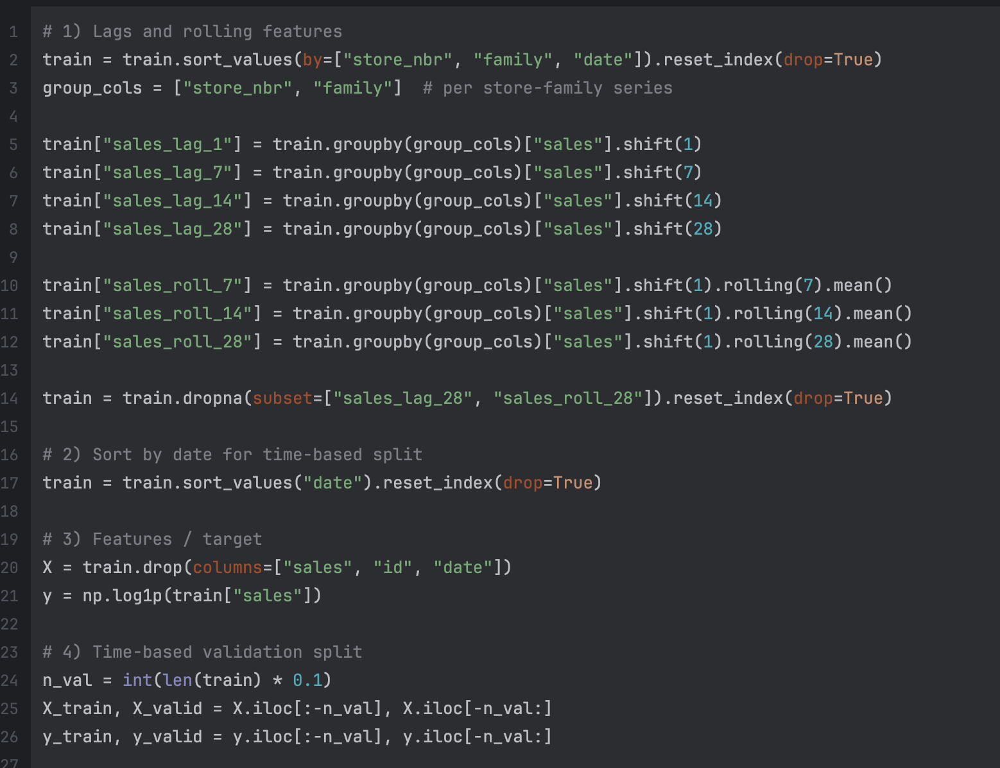

I've done a lot of work with tabular data so the purpose of this competition was just to get use to rolling windows. I ran into some errors that made me jump around hoops in order to not retrain my catboost model. Anyways, this was a great learning experience.

The main thing was just getting comfortable with tabular data when the prediction is supposed to be time-series.

